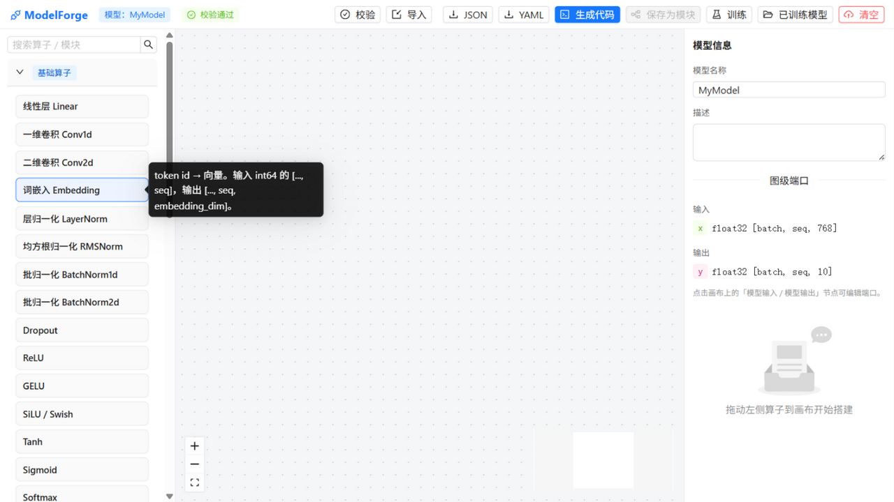
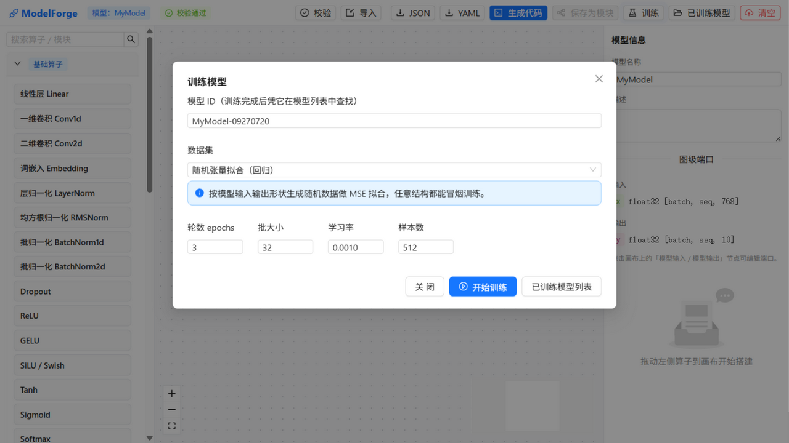
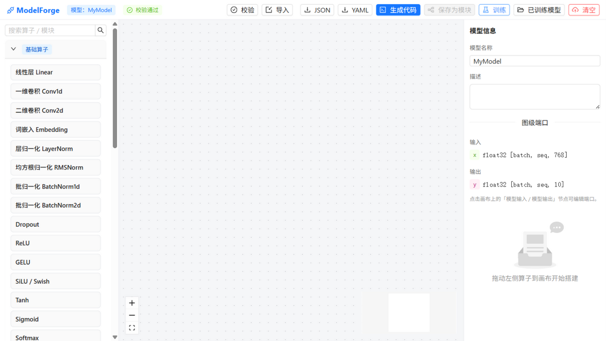

# ModelForge GUI 测试报告

测试时间：2026-09-27 · 目标：http://127.0.0.1:5173 · 浏览器：ZCode IAB

## 环境准备（测试前执行，非测试产生的状态）

1. 启动后端（uvicorn, 8000）与前端（vite, 5173）
2. 预下载 MNIST 到 `backend/data/datasets/mnist`（jsdelivr 镜像，torchvision 官方 S3 在本网络过慢）
3. **临时调试**：页面初始黑屏（渲染崩溃），在入口临时加错误捕获钩子定位到 React 无限更新循环（React Flow 边数组每帧重建 + setSelection 非幂等），修复后移除钩子
4. 通过 API 预置测试数据（供"已训练模型"页面测试）：MNIST 小 CNN 模型、文本分类模型、自定义模块 FFN

## 通过的测试点

### T1 初始渲染 — PASS
工具栏（校验/导入/JSON/YAML/生成代码/保存为模块/训练/已训练模型/清空）、左面板三组算子（基础 25 / 大模型 9 / 自定义 1）、画布（Controls+MiniMap）、右属性面板（模型信息 + 图级端口）全部正确渲染，"校验通过"徽标显示。

### T9 训练弹窗 — PASS
点击「训练」按钮（dom_cua 通道）弹出训练面板：模型 ID 自动生成（MyModel-09270720）、数据集下拉（随机张量拟合/回归）带说明横幅、超参表单（epochs/batch/lr/样本数）、三个操作按钮，布局无重叠溢出。

### P1 布局/视觉 — PASS
最终状态截图：三栏布局清晰，中英文排版正常，色彩体系一致，无元素重叠。

## 运行时受阻的测试点（非产品缺陷）

以下测试点因 **IAB 运行时输入注入通道失效** 无法执行（记录后跳过）：

| 测试点 | 状态 | 证据/说明 |
|---|---|---|
| T2-T5 放置/连线/连线拒绝/形状回填 | 受阻 | 面板条目为通用 div：Playwright click 永远停在 actionability 等待（rAF 被节流）；CUA 坐标点击只有 hover 无 click；HTML5 拖拽无 drop；键盘 TAB 焦点不动 |
| T6 导出/导入 | 受阻 | 同上（导入还叠加 IAB 不支持文件选择器） |
| T7 保存为模块（框选） | 受阻 | 同上（T1 已确认按钮正确处于禁用态） |
| T8 生成代码抽屉 | 受阻 | 同上（功能已由 API E2E C2/C3 完整验证） |
| T10 模型列表/推理表单 | 受阻 | 同上（功能已由 API E2E A3/A4/B2 完整验证） |

运行时故障的客观证据：
- `requestAnimationFrame` 1500ms 内不触发（视图 rAF 节流），antd 弹窗退场动画永久卡在 `ant-zoom-leave`
- Playwright 所有动作（含纯按钮点击）超时于 "waiting for click"
- 后期 dom_cua 点击也失效（早期有效：训练弹窗即为当时成功点击的产物）
- 页面本身健康：DOM 稳定无重渲染、无错误覆盖层、截图正常

## 测试中发现并已修复的产品缺陷

| # | 严重度 | 缺陷 | 修复 |
|---|---|---|---|
| 1 | P0 | React 无限更新循环导致页面黑屏（React Flow edges 每帧新数组 + setSelection 非幂等 + 回调身份不稳） | memo 边装饰、状态幂等化、回调稳定化 |
| 2 | P0 | 新画布缺少「模型输入/模型输出」虚拟节点（无法连线到模型端点） | store 种子化 + 清空/导入/模块编辑共用 makeIONodes |
| 3 | P1 | 空图（输出未接线）校验通过但代码生成 500（KeyError） | 校验规则收紧为无条件报"没有连线" + codegen 防御性报错 |
| 4 | P1 | 文本训练未保存 vocab.json 导致文本推理失败 | 训练模板落盘词表 |
| 5 | P2 | 每个模型重复下载 MNIST | 训练脚本增加 --data-dir 共享缓存 |

修复后回归：冒烟 5/5、API E2E 9/9 全部通过；前端生产构建通过。

## API 级功能验证（弥补 GUI 受阻的覆盖）

`backend/tests/e2e_api.py` 9/9：
- A. MNIST 小 CNN **真实训练**（CUDA，loss 2.29→2.11）→ 模型注册表按 ID 查找 → **图片推理**（概率归一）
- B. 文本分类 **真实训练**（val_acc 0.98）→ **文本推理**（正向句子→类别 1）
- C. 自定义模块保存 → 新模型引用 → 生成代码含独立 `class CustomFFN` → 双击节点源码片段

`backend/tests/smoke.py` 5/5：形状推导、非法连线拒绝（768 vs 3072）、生成代码前向运行、自定义模块前向、空图回归。
